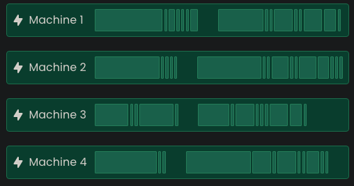
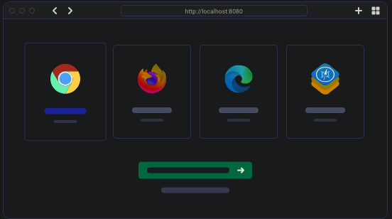

# Cypress Automation Framework


Este proyecto es un framework de automatización de pruebas utilizando [Cypress](https://www.cypress.io/). Está organizado para facilitar la creación, ejecución y mantenimiento de pruebas automatizadas de aplicaciones web.

## Estructura del Proyecto

```
cypress-automation-framework/
├── cypress.config.js
├── package.json
├── cypress/
│   ├── downloads/
│   ├── e2e/
│   │   ├── 1-getting-started/
│   │   │   └── todo.cy.js
│   │   ├── 2-advanced-examples/
│   │   │   ├── automation-test-store/
│   │   │   │   ├── contact-us.js
│   │   │   │   ├── inspect-item.js
│   │   │   │   ├── iterate-over-elements.js
│   │   │   │   └── variables-and-cy-commands.js
│   │   │   ├── other/
│   │   │   │   └── same-origin-policy.js
│   │   │   ├── webdriver-uni/
│   │   │   │   ├── contact-us.js
│   │   │   │   └── selectors.js
│   ├── fixtures/
│   │   └── example.json
│   ├── screenshots/
│   ├── support/
│   │   ├── commands.js
│   │   └── e2e.js
│   ├── videos/
│   │   ├── 1-getting-started/
│   │   │   └── todo.cy.js.mp4
│   │   ├── 2-advanced-examples/
│   │   │   ├── automation-test-store/
│   │   │   │   └── contact-us.js.mp4
│   │   │   ├── webdriver-uni/
│   │   │   │   ├── contact-us.js.mp4
│   │   │   │   └── selectors.js.mp4
```



## Instalación

1. Clona el repositorio:
   ```bash
   git clone <url-del-repositorio>
   ```
2. Instala las dependencias:
   ```bash
   npm install
   ```

## Ejecución de Pruebas

Para ejecutar las pruebas en modo interactivo:
```bash
npx cypress open
```

Para ejecutar las pruebas en modo headless:
```bash
npx cypress run
```



## Estructura de Carpetas
- **cypress/e2e/**: Contiene los archivos de pruebas organizados por ejemplos y casos de uso.
- **cypress/fixtures/**: Archivos de datos de prueba.
- **cypress/support/**: Comandos personalizados y configuración global de Cypress.
- **cypress/screenshots/** y **cypress/videos/**: Evidencias generadas por Cypress al ejecutar las pruebas.

## Recursos
- [Documentación oficial de Cypress](https://docs.cypress.io/)

## Autor
- GitTestingPat

## Licencia
Este proyecto está bajo la licencia MIT.
